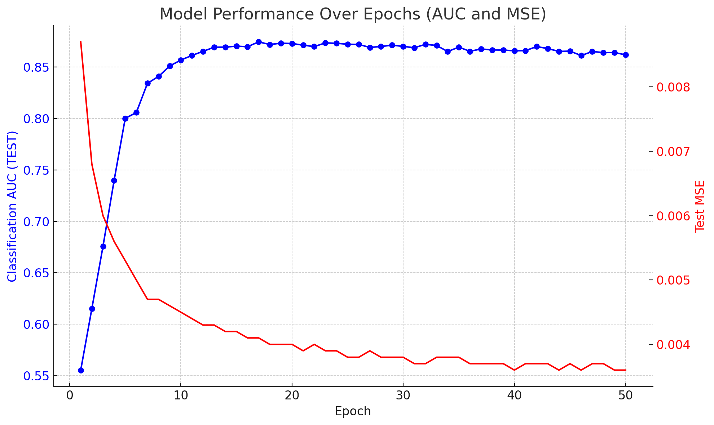

# Latent ODEs for Irregularly-Sampled Time Series (Reproduction and Extension)

This repository contains code for reproducing the experiments from the paper:
> Yulia Rubanova, Ricky Chen, David Duvenaud. "Latent ODEs for Irregularly-Sampled Time Series" (2019) [[arxiv]](https://arxiv.org/abs/1907.03907)

Additionally, this repository tracks the performance of my own implementation of some experiments, where I compare the results with the original paper's benchmarks.

<p align="center">

</p>

## Performance Comparison

Below is a summary of performance comparisons between the original paper and my reproduced experiments. More detailed results will be added as additional experiments are conducted.

| Dataset       | Metric           | Paper Result         | My Implementation |
|---------------|------------------|----------------------|-------------------|
| MuJoCo        | MSE               | See Table Below      | See Table Below   |
| Physionet     | AUC               | See Table Below      | 0.8635            |
| Human Activity| Accuracy          | See Table Below      | See Table Below   |


### Physionet - AUC Scores (from Table 6 of the paper)

| Method                    | AUC               |
|---------------------------|-------------------|
| RNN                       | 0.787 ± 0.014     |
| RNN-Impute                | 0.764 ± 0.016     |
| RNN-Decay                 | 0.807 ± 0.003     |
| RNN GRU-D                 | 0.818 ± 0.008     |
| RNN-VAE                   | 0.515 ± 0.040     |
| Latent ODE (RNN encoder)   | 0.781 ± 0.018     |
| ODE-RNN                   | 0.833 ± 0.009     |
| Latent ODE (ODE encoder)   | 0.829 ± 0.004     |
| Latent ODE + Poisson       | 0.826 ± 0.007     |
| **My Implementation**      | **0.8635**        |


**Note:** More results to come as experiments progress.

### My Experimentation

In addition to the original models, I am conducting my own experiments using alternative configurations and modifications to test performance. Here is one of the experiment settings used in my reproduction:


#### Results (up to 50 epochs):

- :
  - Classification AUC (TEST): 0.8635
  - Test MSE: 0.0036
  - Poisson likelihood: 0.0
  - Cross-Entropy (CE) loss: 0.0936
  - Number of labeled examples: 2400
  - Number of examples with mortality 1: 300

<p align="center">  </p>
More visualizations and results will be added as I complete additional experiments.


## Prerequisites

Install the `torchdiffeq` library from https://github.com/rtqichen/torchdiffeq.

## Experiment Instructions

The dataset is downloaded and processed automatically when running the scripts for the first time. 

Raw datasets:
- [[MuJoCo]](http://www.cs.toronto.edu/~rtqichen/datasets/HopperPhysics/training.pt)
- [[Physionet]](https://physionet.org/physiobank/database/challenge/2012/)
- [[Human Activity]](https://archive.ics.uci.edu/ml/datasets/Localization+Data+for+Person+Activity/)

To generate MuJoCo trajectories from scratch, [DeepMind Control Suite](https://github.com/deepmind/dm_control/) is required.

### Running the Original Paper's Models

You can reproduce the original experiments using the following commands:

- **Toy dataset of 1d periodic functions**:
    ```bash
    python3 run_models.py --niters 500 -n 1000 -s 50 -l 10 --dataset periodic --latent-ode --noise-weight 0.01 
    ```

- **MuJoCo**:
    ```bash
    python3 run_models.py --niters 300 -n 10000 -l 15 --dataset hopper --latent-ode --rec-dims 30 --gru-units 100 --units 300 --gen-layers 3 --rec-layers 3
    ```

- **Physionet (discretization by 1 min)**:
    ```bash
    python3 run_models.py --niters 100 -n 8000 -l 20 --dataset physionet --latent-ode --rec-dims 40 --rec-layers 3 --gen-layers 3 --units 50 --gru-units 50 --quantization 0.016 --classif
    ```

- **Human Activity**:
    ```bash
    python3 run_models.py --niters 200 -n 10000 -l 15 --dataset activity --latent-ode --rec-dims 100 --rec-layers 4 --gen-layers 2 --units 500 --gru-units 50 --classif --linear-classif
    ```

### My Experimentation

In addition to the original models, I am conducting my own experiments using alternative configurations and modifications to test performance. These results will be documented in the **Performance Comparison** section as they become available.

### Running Alternative Models

Here are commands to run different model variations included in the original paper:

- **ODE-RNN**:
    ```bash
    python3 run_models.py --niters 500 -n 1000 -l 10 --dataset periodic --ode-rnn
    ```

- **Latent ODE with ODE-RNN encoder**:
    ```bash
    python3 run_models.py --niters 500 -n 1000 -l 10 --dataset periodic --latent-ode
    ```

- **Latent ODE with ODE-RNN encoder and Poisson likelihood**:
    ```bash
    python3 run_models.py --niters 500 -n 1000 -l 10 --dataset periodic --latent-ode --poisson
    ```

- **Latent ODE with RNN encoder (Chen et al., 2018)**:
    ```bash
    python3 run_models.py --niters 500 -n 1000 -l 10 --dataset periodic --latent-ode --z0-encoder rnn
    ```

- **RNN-VAE**:
    ```bash
    python3 run_models.py --niters 500 -n 1000 -l 10 --dataset periodic --rnn-vae
    ```

- **Classic RNN**:
    ```bash
    python3 run_models.py --niters 500 -n 1000 -l 10 --dataset periodic --classic-rnn
    ```

- **GRU-D** (input imputation and hidden state decay):
    ```bash
    python3 run_models.py --niters 500 -n 100 -b 30 -l 10 --dataset periodic --classic-rnn --input-decay --rnn-cell expdecay
    ```

### Visualization

To generate the visualizations similar to the original paper:
```bash
python3 run_models.py --niters 100 -n 5000 -b 100 -l 3 --dataset periodic --latent-ode --noise-weight 0.5 --lr 0.01 --viz --rec-layers 2 --gen-layers 2 -u 100 -c 30
